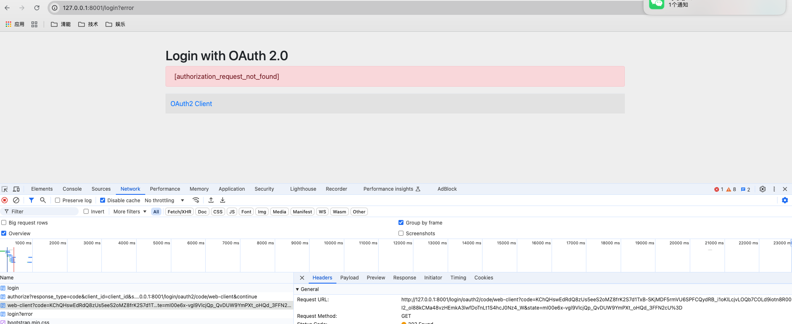
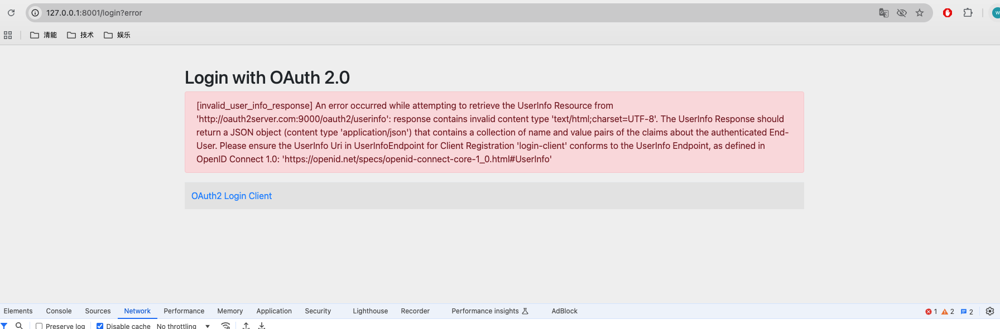
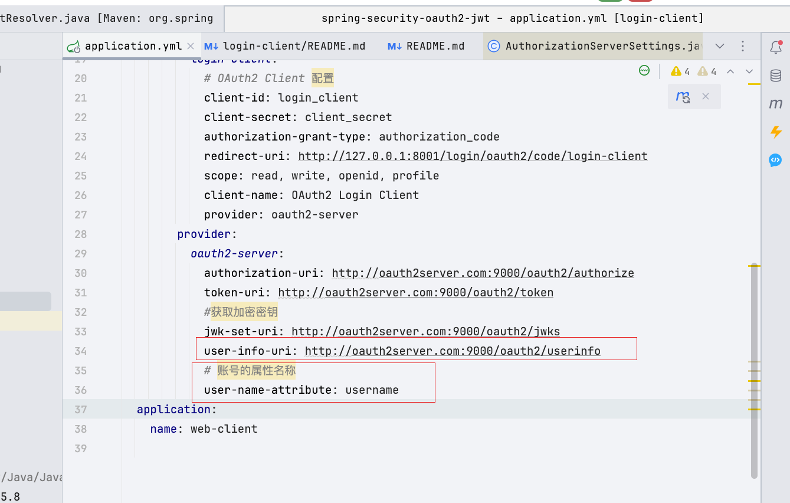
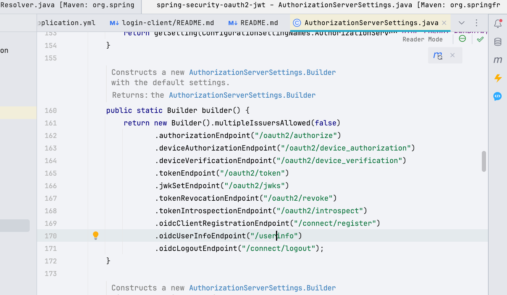

## QA

- **`OAuth2 Server` 的地址使用域名**
  `client`端需要与`server`端`domain`区别开，否则会导致`session`读取异常。异常信息如下：

  

  源码如下：`org.springframework.security.oauth2.client.web.OAuth2LoginAuthenticationFilter#attemptAuthentication`其原因是无法从`request`对象中获取`session`。

- **`OAuth2 Server` 启用 `OpenID Connect 1.0(OIDC)` 获取用户信息的`/userinfo` `endpoint`异常**
  异常信息如下：

  

  客户端配置信息如下：

  

  `endpoint`配置异常，正确的`endpoint`应当是`/userinfo`，而不是`/oauth2/userinfo`。 `OAuth2 Server`默认的`endpoint`信息如下：

  

  源码地址：`org.springframework.security.oauth2.server.authorization.settings.AuthorizationServerSettings#builder`

- **为什么 Thymeleaf 只能用 @Controller 而不能用 @RestController**

  ​	1.	**视图解析器行为：**

  当使用 @Controller 并返回一个字符串时，Spring 会认为这个字符串是视图的名称，并且会使用视图解析器（如 Thymeleaf）查找和渲染相应的模板文件。

  但是如果使用 @RestController，它会自动将返回值序列化为 JSON 或 XML，而不会尝试进行视图解析。所以 Thymeleaf 模板引擎不会被触发，页面也就不会被渲染出来。

  ​	2.	@ResponseBody **的影响：**

  @RestController 等同于 @Controller + @ResponseBody，它告诉 Spring 不要进行视图解析，而是直接将返回的数据作为 HTTP 响应的主体。因此，当你使用 @RestController 时，Thymeleaf 模板引擎不会被调用，因为它不会去解析视图，而是直接返回 JSON 或其他格式的数据。

- 